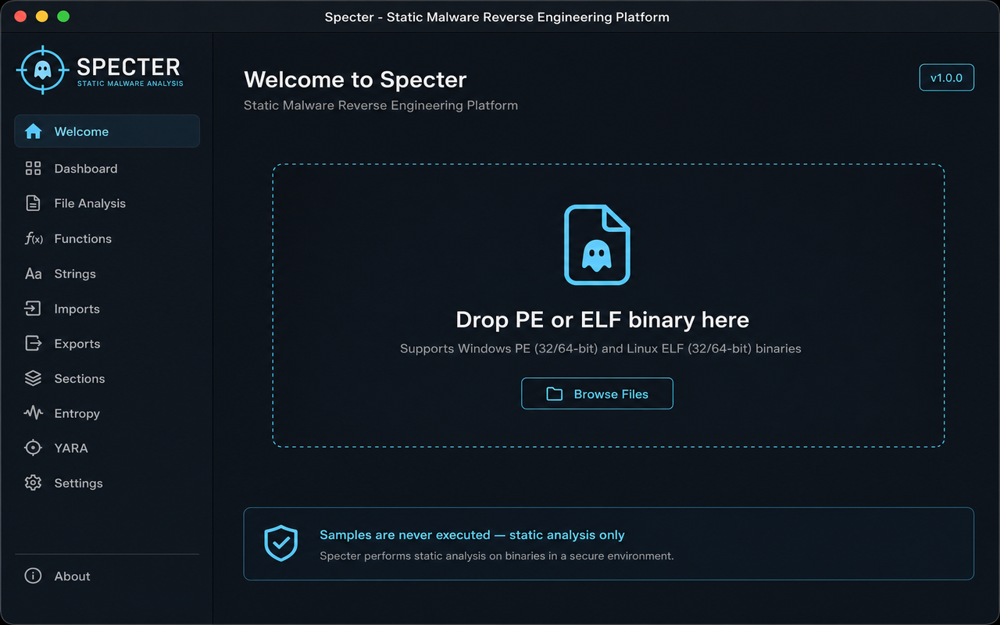

# Specter

**Specter — Static Malware Reverse Engineering Platform**

Specter is a native macOS desktop application for **static malware analysis and reverse engineering**. It inspects Windows PE and Linux ELF binaries on your Mac **without executing them**, surfacing behavioral indicators, MITRE ATT&CK mappings, Rust-specific triage, and visual workflows to help analysts understand suspicious samples quickly.



---

## Safety model

Specter performs **read-only static analysis only**. Samples are never executed, spawned, or sandbox-run inside the app. All findings come from parsing file structure, strings, imports, entropy, and pattern matching against the binary on disk.

> **Use real malware samples only in isolated analysis environments.** Exported reports may contain sensitive indicators (URLs, credentials, paths) extracted from the sample.

---

## Features

### Binary analysis

| Feature | Description |
|---------|-------------|
| **PE & ELF support** | Parses Windows PE (32/64-bit) and Linux ELF binaries |
| **Binary overview** | Format, architecture, entry point, image base, SHA-256/MD5, section map |
| **Import analysis** | Imported APIs grouped by behavior category (network, persistence, crypto, etc.) |
| **String extraction** | ASCII/Unicode strings with sensitivity tagging |
| **Entropy & heatmap** | Per-section entropy and a byte-level heatmap visualization |
| **Disassembly preview** | Static disassembly via system `objdump` (when available) |

### Rust-focused triage

| Feature | Description |
|---------|-------------|
| **Rust detection** | Identifies likely Rust binaries via mangled symbols and runtime strings |
| **Panic/unwrap indicators** | Surfaces common Rust panic paths and async runtime references |
| **Rust Intel panel** | Dedicated view for Rust-specific analysis signals |

### Threat intelligence

| Feature | Description |
|---------|-------------|
| **YARA-style rules** | Built-in pattern rules for C2, persistence, evasion, credentials, and more |
| **MITRE ATT&CK mapping** | Maps imports and strings to ATT&CK techniques |
| **Threat surface radar** | Visual summary of capability categories |
| **Risk scoring** | Narrative-driven risk level (Low / Medium / High / Critical) |

### Visual workflows

| Feature | Description |
|---------|-------------|
| **Attack narrative** | Chronological story of likely malware behavior |
| **Activity flow graph** | Interactive behavior flow with category coloring |
| **Evidence correlation graph** | Links imports, strings, and behaviors into a correlation view |

### Export & external tools

| Feature | Description |
|---------|-------------|
| **Markdown reports** | Full analysis export with metadata, MITRE, YARA, and narrative |
| **PDF reports** | Formatted PDF export for sharing or archival |
| **Ghidra integration** | Jump to virtual addresses in Ghidra (GUI or headless import) |
| **IDA Pro integration** | Launch IDA with helper scripts targeting evidence addresses |
| **Binary Ninja integration** | Open samples in Binary Ninja with auto-navigation plugin |

Configure external disassemblers via **Disassemblers** in the app toolbar.

---

## Requirements

- **macOS** with Xcode installed (project targets macOS 26.5+)
- **Xcode 26** (or compatible version that supports the deployment target)
- **Apple Developer signing** — update the development team in the Xcode project for local builds
- **Optional:** Ghidra, IDA Pro, and/or Binary Ninja for external disassembler linking
- **Optional:** `/usr/bin/objdump` (included with Xcode Command Line Tools) for disassembly preview

---

## Getting started

### 1. Clone the repository

```bash
git clone https://github.com/pa-legg/specter-rust-disassembler.git
cd specter-rust-disassembler
```

### 2. Open in Xcode

```bash
open malware-analysis.xcodeproj
```

Select the **malware-analysis** scheme, choose **My Mac** as the run destination, and press **Run** (⌘R).

### 3. Try the demo sample

On the welcome screen, click **Load Safe Demo Sample** to analyze a synthetic PE binary with placeholder indicators — no real malware required.

You can also drag and drop a PE or ELF file onto the drop zone, or use **Open Binary** to select a file.

---

## Building from the command line

### Debug build

```bash
xcodebuild \
  -project malware-analysis.xcodeproj \
  -scheme malware-analysis \
  -configuration Debug \
  build
```

The app bundle is written to:

```
~/Library/Developer/Xcode/DerivedData/<project-hash>/Build/Products/Debug/malware-analysis.app
```

### Release build

```bash
xcodebuild \
  -project malware-analysis.xcodeproj \
  -scheme malware-analysis \
  -configuration Release \
  build
```

Output location:

```
~/Library/Developer/Xcode/DerivedData/<project-hash>/Build/Products/Release/malware-analysis.app
```

To locate the exact path after a build:

```bash
xcodebuild -project malware-analysis.xcodeproj -scheme malware-analysis -configuration Release -showBuildSettings \
  | grep -m1 'BUILT_PRODUCTS_DIR'
```

### Run the built app

```bash
open ~/Library/Developer/Xcode/DerivedData/*/Build/Products/Debug/malware-analysis.app
```

---

## Deploying for distribution

Specter is intended for **local analyst use** and is not currently configured for Mac App Store submission (external tool integration and subprocess usage require a direct distribution model).

### Developer ID distribution (recommended)

1. Open `malware-analysis.xcodeproj` in Xcode.
2. Select the **malware-analysis** target → **Signing & Capabilities**.
3. Set your **Team** and ensure **Hardened Runtime** and **App Sandbox** are enabled.
4. Choose **Product → Archive**.
5. In the Organizer, **Distribute App → Developer ID** and follow the notarization workflow.

### Ad hoc / local install

After a Release build, copy the app to `/Applications`:

```bash
cp -R ~/Library/Developer/Xcode/DerivedData/*/Build/Products/Release/malware-analysis.app /Applications/
```

On first launch, macOS may require you to allow the app in **System Settings → Privacy & Security** if it is not notarized.

### Code signing notes

- The bundle identifier is `com.pa-legg.malware-analysis`.
- Replace `DEVELOPMENT_TEAM` in `malware-analysis.xcodeproj/project.pbxproj` with your own team ID, or override it in Xcode signing settings.
- Sandbox entitlements include user-selected file read/write access for opening samples and saving exports.

---

## External disassembler setup

Open **Disassemblers** in the toolbar to configure paths. Defaults:

| Tool | Default path |
|------|----------------|
| Ghidra | `/Applications/ghidra/ghidraRun` |
| IDA Pro | `/Applications/IDA Professional 8.4/ida64.app` |
| Binary Ninja | `/Applications/Binary Ninja.app` |

When you jump to an address from the evidence graph or narrative:

1. The target address is copied to your clipboard.
2. The external tool is launched with the sample.
3. For Binary Ninja, a Specter plugin is installed on first use to navigate after analysis completes.

---

## Project structure

```
├── malware-analysis.xcodeproj/   # Xcode project
├── malware-analysis/             # Swift source
│   ├── Analysis/                 # Parsers, scanners, graph builders
│   ├── Export/                   # PDF/Markdown export, disassembler integration
│   ├── Models/                   # Shared data models
│   ├── Theme/                    # App styling
│   ├── ViewModels/               # Analysis state
│   └── Views/                    # SwiftUI views
├── Specter/                      # App icon and marketing screenshots
└── samples/                      # Synthetic demo sample generator
```

---

## Screenshots

| View | Preview |
|------|---------|
| Welcome | `Specter/Screenshots/01-welcome-1280x800.png` |
| Attack narrative | `Specter/Screenshots/02-attack-narrative-1280x800.png` |
| Evidence graph | `Specter/Screenshots/03-evidence-graph-1280x800.png` |
| MITRE ATT&CK matrix | `Specter/Screenshots/04-mitre-matrix-1280x800.png` |

Retina (2×) versions are available alongside each screenshot in `Specter/Screenshots/`.

---

## Regenerating the demo sample

A Python script can rebuild the synthetic PE used by the demo loader:

```bash
python3 samples/generate_demo_sample.py
```

---

## License

No license file is included yet. All rights reserved unless otherwise specified by the repository owner.

---

## Disclaimer

Specter is a research and triage aid for security professionals. It does not replace full dynamic analysis, sandbox detonation, or professional reverse engineering workflows. Always handle malware samples according to your organization's security policies.
